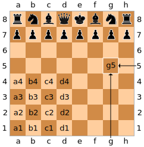

# 2-Player Chess

Worth 100 points (10% of course grade.)

For this assignment you will explore how to apply the object-oriented design ideas you learned in class to design and implement the chess game.

You will work in pairs on this assignment. Read the [DCS Academic Integrity Policy for Programmming Assignments](http://www.cs.rutgers.edu/academics/undergraduate/academic-integrity-policy/programming-assignments) - you are responsible for this. In particular, note that **"All Violations of the Academic Integrity Policy will be reported by the instructor to the appropriate Dean"**.

IMPORTANT: Note that you will be maintaining your code in [Bitbucket](https://bitbucket.org/), which is a source code repository. Learning how to manage your source code INCREMENTALLY and in COLLABORATION with your project partner is an important skill, and Bitbucket (like GitHub) is a code repository that allows you to do this effectively. Read the last section on Submission for more details.

---

You will implement the game of [Chess](http://en.wikipedia.org/wiki/Chess) for two players. Your program, when launched, should draw the board in text, on the terminal and prompt whomever's turn it is (white or black) for a move. Once the move is executed, the move should be played and the new board drawn, and the other player queried.

---

## Output

The board should be drawn on the screen with ascii art **EXACTLY** as shown in this [example](display.txt). Note there is a blank line above and below any prompt/message your program will print, and the board itself. Deviations from this exact format will incur a penalty.

**You will NOT use a graphical user interface**, that is not the point of this assignment. If you do, your submission will NOT be graded.

**You MUST have white make the first move**. Having black make the first move is not appropriate, and will incur a penalty.

If you are not clear about any of this, or have ANY questions or issues, CHECK with your grader.

Note:

-  Every piece must know what moves are allowed on it. If a player attempts an illegal move on a piece, your program should not execute the move. Instead, it should print `"Illegal move, try again"`, followed by the usual prompt (for white's move or black's move).
-  When a move is made, and it puts the opponent's King under check, your program should print `"Check"` before prompting for the opponent's move.
-  If a checkmate is detected, your program should print `"Checkmate"`
-  The last thing before termination should be a display of `"Black wins"`, `"White wins"` or `"draw"`.

## Input

Your program needs to accept input of the form `"FileRank FileRank"`, where the first file (column) and rank (row) are the coordinates of the piece to be moved, and the second file and rank are the coordinates of where it should end up. (See the board example shown above.)

The figure immediately below should make it clear which rank and file combinations belong to which squares. The white pieces always intially occupy ranks `1` and `2`. The black pieces always initially occupy ranks `7` and `8`. The queen always starts on the `d` file.

As an example, advancing the white king's pawn two spaces would be input as `"e2 e4"`.

A castling move is indicated by specifying where the king begins and ends. So, white castling king's side would be `"e1 g1"`.

A pawn promotion is indicated by putting the piece to be promoted to after the move. So, promoting a pawn to a knight might be `"g7 g8 N"`. If no promotion piece is indicated, it is assumed to be a queen.

[Example of black winning](ex1.txt)

## Ending the game

If checkmate occurs, the game shall end immediately with the result reported.

A player may resign by entering "resign".

-  [Example of white resigning](ex_res_w.txt)
-  [Example of black resigning](ex_res_b.txt)

A player may offer a draw by appending `"draw?"` to the end of an otherwise regular move. The draw may be accepted by the other player submitting `"draw"` as the entirety of his or her next move. There will be no automatic draws (due to unchanging positions over long periods of time, etc).

-  [Example of a draw](ex_draw.txt)

**You are NOT required to implement termination by threefold repetition, or the fifty-move rule**. (You are welcome to include them in your code to make it complete; however, there is no extra credit for either.)

## Grading

-  **Correctness, 90 pts**: Implementation of all required functionality including drawing the board:

   -  All legitimate basic moves for all pieces
   -  Castling
   -  Enpassant
   -  Promotion
   -  Identification of check
   -  Identifcation of checkmate
   -  Identification of illegal move (print "Illegal move, try again")
   -  Resign
   -  Draw
   -  Drawing board display as specified

   > Note: You are NOT required to implement stalemate.

-  **Javadoc, 10 pts**: Comment ALL classes, fields, and methods with Javadoc tags (not just plain comments). Also, make sure you record your name in each Java file with the `@author` Javadoc tag. Run `javadoc` to generate the Javadoc HTML documentation

   There are numerous online resources that show how to write Javadoc comments, and how to use the `javadoc` tool. Here's one such [resource](https://www.oracle.com/technical-resources/articles/java/javadoc-tool.html). It's pretty straightforward.

-  Penalties

   -  5 pts: ANY deviation from specified format for drawing the board such as extra spaces, extra blank lines, weird characters, other sketchy artwork, etc.
   -  5 pts: Game starts with black making the first move
   -  5 pts: Javadoc HTML not generated
   -  Up to 5 pts: Incomplete Javadoc tags in code
   -  5 pts (individual): No Bitbucket commit by `YYYY-MM-DD`.
   -  10 pts: Every time you ask us and we test another commit version in your repository that is earlier than the last commit before the deadline.
   -  10 pts: For every 2 hours of lateness, in case there is nothing in the repository for us to test as of the deadline of `YYYY-MM-DD`.

      NOTE: This 2 hour block will be applied STRICTLY starting any time after `XX` PM (even if it is one second), in increments of 2 hours. NO EXCEPTIONS.

## Submission/Code Maintenance in Bitbucket (No, you may NOT use GitHub)

Use the Git/Bucket page to know how create a repository in Bitbucket (**and NO, you may NOT use GitHub!!!**) and manage it using Git. There is a comprehensive walk through of all the features you need to know to manage your code collaboratively. **In particular, all Git examples are shown on the command line, which is the recommended way to use Git from your computer**. This is because it is clear as to what's going on, so it is easy to recover from mistakes, if any. (Using an app/plugin with a GUI generally hides a lot of things under the hood, and if things go awry you may not have enough transparent info to work with and fix things.)

Create a new repository and give your grader read access.

Create an Eclipse project, name it `ChessXX`, where `XX` is the two digit group number. Use packages as necessary. There should be at least one package, called `chess`, with the main class called `Chess` in it. This is the class that we will run when testing your program.

Create a `docs` directory under the project. You will put your complete generated Javadocs HTML documentation in this directory.

**Make your Eclipse project folder the root of your Bitbucket repository**. This way, when we get your project from Bitbucket, we get the entire Eclipse project space, with source and binary files, and all data that is in the project in the right places. (Strictly speaking, we don't need the binaries, so if you find another way to set up your repo that holds all project source and data files, that's fine.)

**EACH partner in the team will make a first Bitbucket commit in the project by `YYYY-MM-DD`**. The first BitBucket commit does not have to be any Java code, you may commit any text file, with as little as a single letter in it.

Thereafter, you will make commits incrementally, as and when you add reasonable functionality to your implementation. Aside from that first commit that should come from each partner, we are not asking for a specific number of commits from either partner, as long as you have found a way to work together.

In any case, do NOT use Bitbucket like a Sakai assignment drop, not making any commits after the first, and then making the second one the final commit just before the deadline. If you do this, you are wasting a great chance to learn an important skill you will be required to use in real projects, and will have one less thing to show to prospective employers.

## Frequently Asked Questions

**Q:** Can we assume the input will always be separated by `" "`? That is, no inputs like `"h7 h6draw?"` or `"h6 h7N"`. In addition, is extra space allowed? For example `"h7 h6 "` or `" h7 h6"` or `"e2 e4"`.

**A:** All inputs will have exactly one space between components, such as `"e2 e4"`, or `"g7 g7 N"`. And there won't be any leading or trailing spaces.

**Q:** Do we have to implement a rule where a player is not allowed to make an otherwise valid move if it will immediately put their king in check?

**A:** Yes. This qualifies as an illegal move.

**Q:** Do we need to worry about bad input, like a player entering `"draw"` without being asked by the other player, or just entering things that don't make sense?

**A:** No

**Q:** The assignment says we have to print `"Illegal move, try again"` if the player attempts an illegal move, but can we print more specific messages to identify the kind of illegal move?

**A:** No, you must stick with the described format.

**Q:** Will differences in output such as `"White is in checkmate"` instead `"Black wins"` be OK?

**A:** No, it's not ok. Your program should print `"Checkmate"` (followed by `"White wins"` or `"Black wins"`).

**Q:** We saw rules elsewhere on castling/what-have-you that go beyond the description on the linked Wikipedia page. Should we implement those?

**A:** No, we are going with the Wikipedia page only. We are not all practiced Chess players.

**Q:** Should we print the board out again if the user tries to input an illegal move?

**A:** No

**Q:** If an opponent's piece is captured, should we indicate a captured piece?

**A:** No

**Q:** For the resign examples, should we add `"Black wins"` or `"White wins"` at the end?

**A:** Yes

**Q:** Can we use GitHub instead of Bitbucket?

**A:** No
