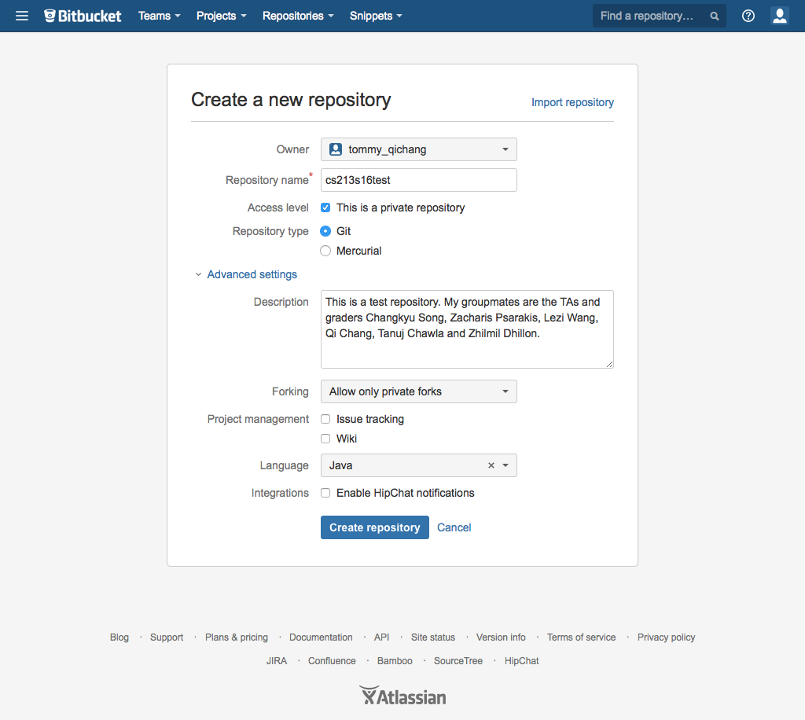
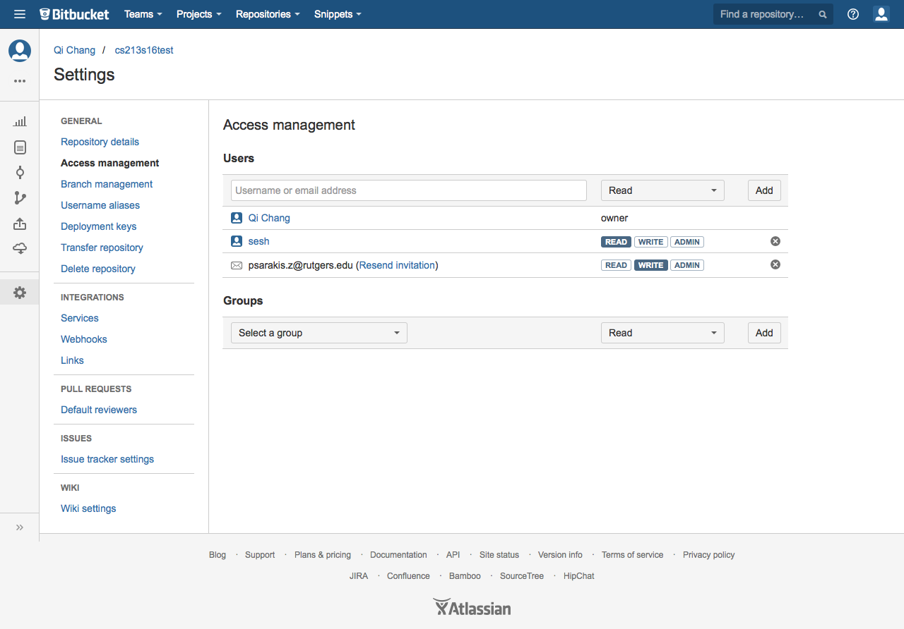
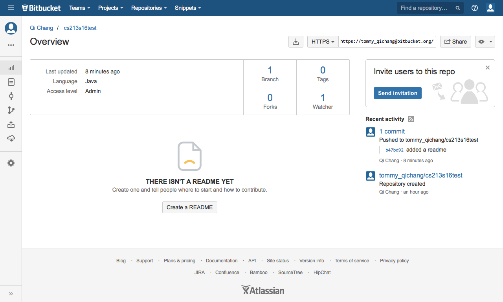

# CS 213: Git and Bitbucket Walkthrough

Git is a distributed version control system, and is the approved method of collaboration for CS213 this semester. It is also required for handing in programming assignments.

The only way that a student should share code with other students in his or her group is via the git push or pull command. It is important that all of a particular student's work be reflected in the commit logs for the project. In the event that the teaching staff is notified that a particular student isn't doing his or her fair share of the work, the commit log will be an important resource for verifying (or debunking) this claim.

Before following the walkthrough, ensure that you have a working copy of git on your computer. In my examples, I will use the command line version of the program. Some students may wish to use some GUI git client or Eclipse EGit plugin. This is fine, but keep in mind that the cs213 staff will only promise to be able to support the command line git tool.

The following walkthrough will have you set up a throw-away repository and collaborate with other students. You will need to create a new repository for each cs213 project.

## 1. Set up an account on [https://bitbucket.org](https://bitbucket.org/)

## 2. Create a new repository

**Bitbucket has changed their UI somewhat since the last edition of this document. But all the necessary aspects of setting up a repository are pretty much still the same as described here.**

After you log into bitbucket.org, you will be shown the Dashboard page. All of your repositories (you might not have any) will be listed on the page.

Open Repositories menu in the top navigation bar and click on the "Create repository" button, to create a new repository. In the new-repository wizard, you can choose a name for your project. For this walkthrough, choose the name "`cs213s16test`".



IMPORTANT: YOU MUST CHECK THE "PRIVATE" BOX FOR ALL CS213 PROJECTS HOSTED ON BITBUCKET.ORG.

-  Make sure that the "Access Level" checkbox labeled "This is a private repository" is checked. This ensures that other students, who are not members of your group, cannot have access to your work.
-  Make sure that the "Repository type" is set to git. The other option is mercurial, which is very similar to git, but for this class you must use git.
-  Choose Java for Language
-  Leave the "issue tracking" and "wiki" boxes unchecked for now. For your actual projects, you may turn those on if you like, but they are not part of any grading for the class.
-  In the "description" box you may put whatever you like, though it might be helpful to give a short summary of the project and group members.

Once everything is filled out, click the "Create repository" button.

Once you have successfully created the repository, you will be directed to the page http://bitbucket.org/yourUserName/cs213s16test - this is your repository's home page.

## 3. Add collaborators and graders

On your repository's home page, click on the Settings gear wheel at the bottom of the navigation bar at the left margin, and on the page that is loaded, click on the "Access Management" in the left hand side navigation column.

In the "Users" field, add your teammate and your grader. For now, give your teammate "write" access and your grader "read" access.



## 4. Clone the repository

Now that your teammate (and grader) have access to the repository, they can go to the repository's home page. In the far left nav bar, below the Java cup, click on the `"..."`, and then on `"Clone"`. This will give you a dialog box with the a Git command line needed for cloning the repository to your computer. In this example it is

```sh
$ git clone https://tommy_qichang@bitbucket.org/tommy_qichang/cs213s16test.git
```

Run this Git command on your computer to make a local clone:

```sh
$ git clone https://tommy_qichang@bitbucket.org/tommy_qichang/cs213s16test.git
Cloning into 'cs213s16test'...
Password for 'https://tommy_qichang@bitbucket.org':
warning: You appear to have cloned an empty repository.
Checking connectivity... done.
```

Now that you have a local clone of the repository, you can do some stuff.

## 5. Check Git status

It's a good habit that check the `git status` for every command especially before you commit something.

After you make a new file, you can check the status of your repository.

```sh
$ cd cs213s16test
$ cat > README
this is just a simple file to read
Ctrl-C
$ git status
On branch master
Initial commit
Untracked files:
(use "git add ..." to include in what will be committed)
README
```

For those of you who aren't super familiar with unix, that business with a `cat >` just wrote text into a new file. (`Ctrl-C` terminates the input file.)

## 6. Add your code

This command adds files to the index, so that Git can track your file status.

Git doesn't include things that you don't tell it about. If you create a file without adding it to the repository, the repository will never have a copy of that file.

```sh
$ git add README
$ git status
On branch master
Initial commit
Changes to be committed:
(use "git rm --cached <file>..." to unstage)
new file: README
```

Now the `README` file is added (but not yet committed).

## 7. Commit a change

The commit operation is the basic "save a version" operation that git is built around. Every time you successfully commit, you are saving a state of your code. Any time in the future you will be able to recover this particular state of your code.

Since it is often difficult to know exactly what causes things to break, it's a good idea to commit whenever you make some kind of atomic change. If you do three things in one session, when possible you should commit each of them separately.

```sh
$ git commit -m "added a readme"
[master (root-commit) b47bd92] added a readme
1 file changed, 0 insertions(+), 0 deletions(-)
create mode 100644 README
```

Then you can check the repository status.

```sh
$ git status
On branch master
Your branch is based on 'origin/master', but the upstream is gone.
(use "git branch --unset-upstream" to fixup)
nothing to commit, working directory clean
```

Now my local version of the repository has this new file.

## 8. Push back to bitbucket.org

IMPORTANT: THE COMMIT OPERATION DOES NOT DO ANYTHING ON THE NETWORK

It's important to realize that a commit operation does _not_ do anything on the network. At the moment, bitbucket.org has no idea that I've done anything locally. To move anything back to bitbucket.org, I need to push it to upstream.

The command for this is simple: `git push [remote-name] [branch-name]`
If you want to push your master branch to your origin server (cloning generally sets up both of those names for you automatically), then you can run this to push any commits you've done back up to the server:

```sh
$ git push origin master
Password for 'https://tommy_qichang@bitbucket.org':
Counting objects: 3, done.
Writing objects: 100% (3/3), 207 bytes | 0 bytes/s, done.
Total 3 (delta 0), reused 0 (delta 0)
To https://tommy_qichang@bitbucket.org/tommy_qichang/cs213s16test.git
* [new branch] master -> master
Branch master set up to track remote branch master from origin.
Password for 'https://tommy_qichang@bitbucket.org':
Branch master set up to track remote branch master from origin.
Everything up-to-date
```

`origin` is the default remote server name. you can check the remote server by this command:

```sh
git remote -v
```

`master` is the branch name.

```sh
git remote -v
origin https://tommy_qichang@bitbucket.org/tommy_qichang/cs213s16test.git (fetch)
origin https://tommy_qichang@bitbucket.org/tommy_qichang/cs213s16test.git (push)
```

Since I didn't say where I was pushing, git pushes back to the repository from which I cloned earlier. That is, it pushes to my `cs213s16test` repository on bitbucket.org.

I can now go back to the repository's home page and check out the new addition.



## 9. Pulling from bitbucket.org

When we pushed to bitbucket.org in the last step, that puts the new source code on the website but not on the hard disk of our collaborators. Since hacking into their computers and adding the files yourself is generally frowned upon, we depend on them running the `pull` command.

When a collaborator clones, he or she will get the most up-to-date version of the repository. But cloning each time to get the latest code is silly. Git provides the `pull` command.

```sh
$ git pull
Password for 'https://tommy_qichang@bitbucket.org':
remote: Counting objects: 2, done.
remote: Compressing objects: 100% (2/2), done.
remote: Total 2 (delta 0), reused 0 (delta 0)
Unpacking objects: 100% (2/2), done.
From https://bitbucket.org/tommy_qichang/cs213s16test
b47bd92..177ca30 master -> origin/master
Updating b47bd92..177ca30
Fast-forward
updates | 0
1 file changed, 0 insertions(+), 0 deletions(-)
create mode 100644 updates
```

As with `push`, if you don't specify a place to pull from, git will use the repository you cloned.

## 10. Push/pull/merge

You cannot push to bitbucket.org if you are out of sync. The way this will mostly happen is if another group member has pushed and you have yet to pull. You will see something like the following.

```sh
$ git push origin master
Password for 'https://tommy_qichang@bitbucket.org':
To https://tommy_qichang@bitbucket.org/tommy_qichang/cs213s16test.git
! [rejected] master -> master (fetch first)
error: failed to push some refs to 'https://tommy_qichang@bitbucket.org/tommy_qichang/cs213s16test.git'
hint: Updates were rejected because the remote contains work that you do
hint: not have locally. This is usually caused by another repository pushing
hint: to the same ref. You may want to first integrate the remote changes
hint: (e.g., 'git pull ...') before pushing again.
hint: See the 'Note about fast-forwards' in 'git push --help' for details.
```

Don't take the advice about "`push -f`" unless you definitely know what you're doing.

The best thing to do here is to pull and update, as in steps [(8)](#8-push-back-to-bitbucketorg) and [(9)](#9-pulling-from-bitbucketorg). It will look something like the following.

You should pull often. Sometimes you need to work on a new feature that is going to take a lot of time to finish. Then, when you're finally done, you pull and merge and see that there are so many conflicts there.

The solution to that is Continuous Integration. In other words, constantly merging your changes with the changes made by your peers. If you include this habit in your routine, you'll find conflicts earlier and they will be a lot easier to fix.

```sh
$ git pull
Password for 'https://tommy_qichang@bitbucket.org':
remote: Counting objects: 3, done.
remote: Compressing objects: 100% (2/2), done.
remote: Total 3 (delta 0), reused 0 (delta 0)
Unpacking objects: 100% (3/3), done.
From https://bitbucket.org/tommy_qichang/cs213s16test
0719575..ae835e1 master -> origin/master
Auto-merging update
CONFLICT (content): Merge conflict in README
Automatic merge failed; fix conflicts and then commit the result.
```

In this situation git will automatically merge conflict files, if it goes well, you need to do nothing.

Sometimes Git is not smart enough to merge changes. In that case you will have...

## 11. Merging conflicts

Sooner or later, two people in your group are going to edit the same file in such a way that Git can't figure out how to merge both changes in at the same time. This is called a merge conflict.

Git will tell you about merge conflicts when you attempt to merge.

```sh
$ git status
On branch master
Your branch and 'origin/master' have diverged,
and have 1 and 1 different commit each, respectively.
(use "git pull" to merge the remote branch into yours)
You have unmerged paths.
(fix conflicts and run "git commit")

Unmerged paths:
(use "git add ..." to mark resolution)

both modified: README
no changes added to commit (use "git add" and/or "git commit -a")
```

In this case, two collaborators edited the same line in README in two different ways. The README file in the working copy has been modified to make it easy to spot the conflict.

```diff
this is just a simple file to read
<<<<<<< HEAD
I added some more stuff. you probably should pull.
=======
I added some more stuff. you definitely should pull.
>>>>>>> ae835e1c79d133a3bde07321495773d5c1e64bc7
```

The line in question, discussing stuff that was added and how certain it is that you should pull, now has two versions. The "`HEAD`" version (the version I created) is between the "`<<<<<<< local`" and "`=======`". The "`other`" verison (the version my collaborator created) is between the "`=======`" and "`>>>>>>> other`".

I should now edit this file to fix the conflict by hand. In this case I'll do the thing that will create the least amount of friction in my group, and go with my collaborator's version.

The file now has no conflict.

```
update from first user, this may have some conflicts
I added some more stuff. you definitely should pull.
```

At this point, you might feel like the right thing to do is to commit.

```sh
$ git add .
$ git commit -m "accepted collaborator's change"
[master 50d740d] accepted collaborator's change
```

you can use `git add README`, while the period (`.`) means add all updates from the same path.

## 12. Check git logs

The `git log` can help you to show each commit. This command give you the power to go back into your project and find any information that you could possibly need.

```
$ git log
commit 50d740dc59e52180ef935d6b093b5420f9384b82
Merge: d11e361 ae835e1
Author: tommy_qichang
Date: Wed Feb 10 18:48:58 2016 -0500

accepted collaborator's change

commit d11e361c7fc5c8712c1af0a97e408556c2043d93
Author: tommy_qichang
Date: Wed Feb 10 18:37:11 2016 -0500

submit by first user
commit ae835e1c79d133a3bde07321495773d5c1e64bc7
Author: tommy_qichang
Date: Wed Feb 10 18:36:05 2016 -0500

update from second user
```

You can display your logs in one line by: `git log --oneline`

```sh
$ git log --oneline
50d740d accepted collaborator's change
d11e361 submit by first user
ae835e1 update from second user
0719575 update from second user
ccad4fd delete
06a6854 updates changes
71e69af modify the updates by the first user
f38a488 add some updates from another user
177ca30 add updates file from another user
b47bd92 added a readme
```

The `--graph` option draws an ASCII graph representing the branch structure of the commit history.
This is commonly used in conjunction with the `--oneline` and `--decorate` commands to make it easier to see which commit belongs to which branch.

```sh
$ git log --oneline --graph --decorate
* 50d740d (HEAD -> master) accepted collaborator's change
|\
| * ae835e1 (origin/master) update from second user
* | d11e361 submit by first user
|/
* 0719575 update from second user
* ccad4fd delete
* 06a6854 updates changes
|\
| * 71e69af modify the updates by the first user
* | f38a488 add some updates from another user
|/
* 177ca30 add updates file from another user
* b47bd92 added a readme
```

## 13. Handing in your project

There are two ways to hand in your project. One is to just make sure that a clone of your project works. You can test this by running the clone command line listed on the repository's home page in an empty directory, and making sure the project that is created works.

Another way is to use a tag. You can tag a particular state of the repository, _AFTER COMMITTING IT_, by using the tag command. To specify the finished version of the project, use the "`final`" tag.

```sh
$ git tag final
```

If you've already done this, but want to move the final tag to a different commit, add the `-f` flag.

```sh
$ git tag -f final
```

Like the commit command, the `tag` command does nothing on the network. You still have to tell bitbucket.org about the new tag by pushing the repository.

```sh
$ git push --tags
Password for 'https://tommy_qichang@bitbucket.org':
Total 0 (delta 0), reused 0 (delta 0)
To https://tommy_qichang@bitbucket.org/tommy_qichang/cs213s16test.git
* [new tag] final -> final
```

To test the tagged version of your project, you can clone your project first and then checkout the specific tag version.

```sh
$ git checkout tags/final
HEAD is now at 50d740d... accepted collaborator's change
```
