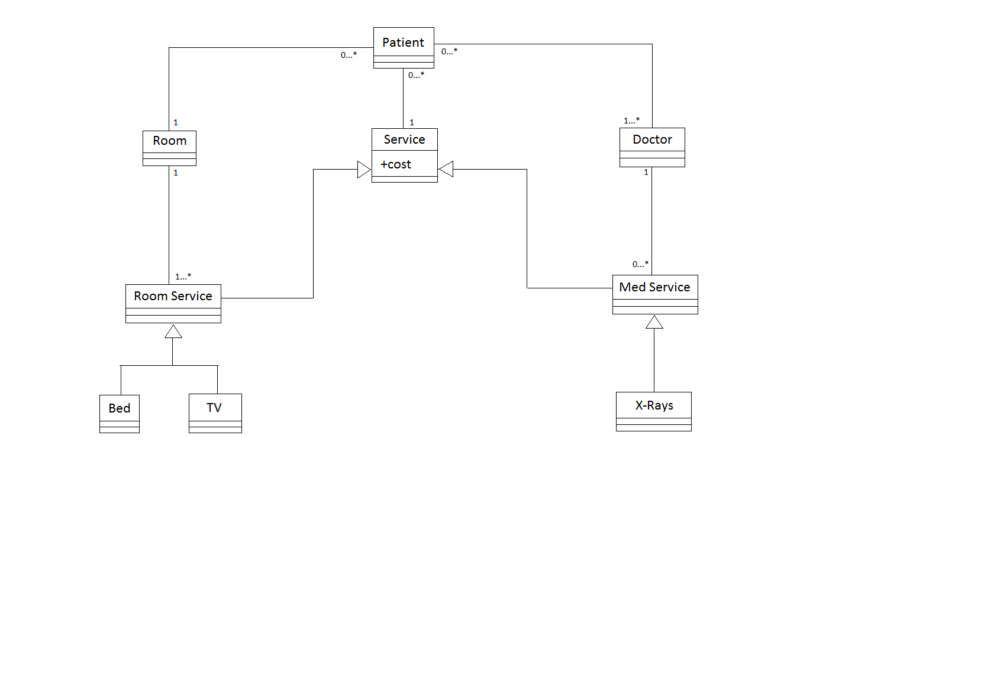

# Problem Set 6 - Access Levels, UML Solution

## Problem 1

Suppose classes `A` and `B` are in package `ab`, and classes `C` and `D` are in package `cd`. Furthermore, both `C` and `B` extend `A`, and `D` extends `B`. Assume all classes are declared to be `public`.

1. Are `protected` members of `A` accessible in `C`? If yes, explain how. If not, explain why.

   **Solution**: Protected members of `A` are inherited by `C`, but not accessible in `C` via instances of `A`.

2. Are `protected` members of `A` accessible in `D`? If yes, how? If not, why?

   **Solution**: Protected members of `A` are _inherited_ by `D` via `B` (in other words, `B` inherits `protected` fields from `A`, and `D` from `B`), but as with `C`, `protected` members in `A` are not visible in `D` via instance of `A`.

3. Solution the same question as in 1. replacing `A` with `B`

   **Solution**: Protected members of `B` are _NOT_ inherited by `C`, nor are they accessible in `C` via instances of A, since C is in a different package than `B`, but does not extend `B`.

4. Solution the same question as in 2. replacing `A` with `B`

   **Solution**: `D` inherits `protected` members of `B` since it subclasses from `B`.

## Problem 2

For each of the following pairs/groups of classes, show the most appropriate relationship between them using UML (include multiplicities for associations).

Also show code outlines for the classes involved, including fields that pertain to the associations between them, if any (i.e. connections that are not super-sub or interface implementations). It doesn't matter exactly what data structure you use for fields that are collections - that is something that can be refined at implementation time, and does not change the UML. (Remember, the UML is language-independent, and different languages may offer different options of data structures.)

1. `Document-Keyword `in a search engine

   **Solution**:

   ```
            *   Contains >>  *
   Document ------------------ Keyword
   ```

   This is a bidirectional relationship, i.e. a document can get at all the keywords in it, and a keyword can get at all the doocuments that contain it.

   ```java
   import java.util.List;

   public class Keyword {
      List<Document> documents;  // documents that contain this keyword, could be null
      // ...
   }
   ```

   ```java
   import java.util.List;

   public class Document {
      List<Keyword> keywords;  // keywords in this document, could be null
      // ...
   }
   ```

2. `Friend-Friend` on Facebook

   **Solution**:

   ```
           -------
          |      |
         *|      |
       Friend ----
              *
   ```

   ```java
   import java.util.List;

   public class Friend {
      List<Friend> friends;   // could be null
      // ...
   }
   ```

3. `Book-Chapter`

   **Solution**:

   ```
               1..*
   Book <>---------- Chapter   (Composition, diamond on Book should be shaded)
   ```

   Note: Multiplicity is not required on the `Book` side since by definition of a composition, a `Chapter` can only be in 1 book

   ```java
   import java.util.List;

   public class Book {

      public class Chapter {
         // ...
      }

      // must have at least one item, will be enforced
      // in any logic that accesses chapters
      List chapters;

      // ...
   }
   ```

   Note: `Chapter` is an inner class because a chapter is only defined in the context of a book, and is non-static because you can't create a `Chapter` instance without having a `Book` instance to contain it. In other words, there are no free-standing chapters. So, for instance, you might do something like this:

   ```java
   Book         book    = new Book();
   Book.Chapter chapter = book.new Chapter();
   ```

4. `Parking Lot-Car`

   **Solution**:

   ```
                1        *
   ParkingLot <>---------- Car (Aggregation that is NOT a composition, diamond not shaded)
   ```

   Note: This is an aggregation since a parking lot contains cars. However, it is not a composition - if the parking lot goes away, the cars will continue to exist. In other words, the existence of a car does not depend on the lot in which it is parked.

   ```java
   import java.util.List;

   public class ParkingLot {
      List<Car> cars;
      // ...
   }
   ```

   ```java
   public class Car {
      ParkingLot lot;   // single lot at which this car is parked, could be null
      // ...
   }
   ```

## Problem 3

You are on a project that is developing software to manage a hospital. In particular, you are working on a sub-system that will model the patient care aspect including doctors, patients, hospital rooms, and services for which patients are billed. Services include medical services such as x-rays, as well as room services such as bed, TV, etc.

Draw a UML class diagram of your model, with just the names of classes (fields and methods not required), and relationships between them. Make sure to show multiplicities on associations.

### Problem 3 Solution

> Some small changes may have been made in recitation, especially with multiplicities, so treat this as a starting solution.


