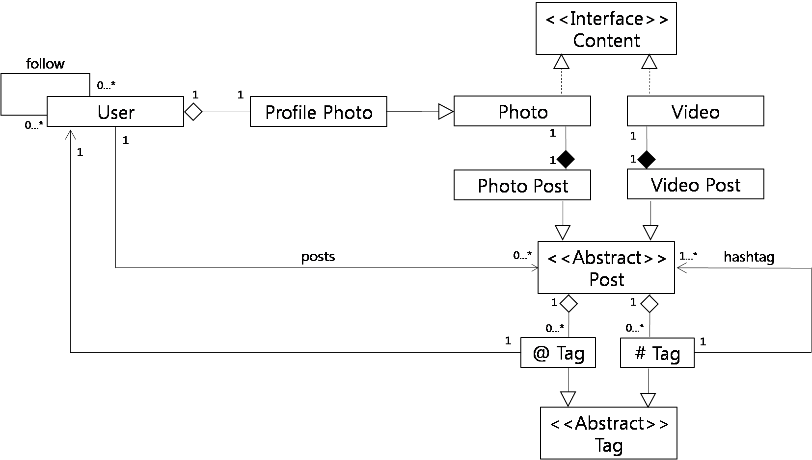
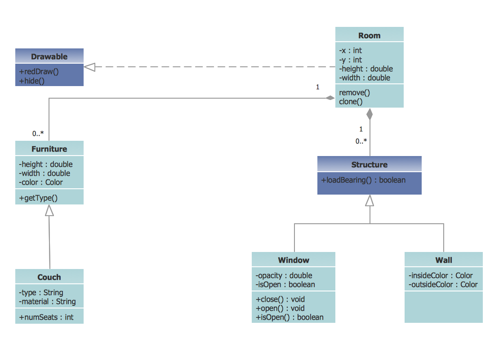

# Problem Set 7 - UML Solution

## Problem 1

For each of the following pairs/groups of classes, show the most appropriate relationship between them using UML (include multiplicities for associations). Each entity must have the minimal number of key attributes that characterize it.

Also show code outlines for the classes involved, including fields that pertain to the associations between them, if any (i.e. connections that are not super-sub or interface implementations). It doesn't matter exactly what data structure you use for fields that are collections--that is something that can be refined at implementation time, and does not change the UML. (Remember, the UML is language-independent, and different languages may offer different options of data structures.)

1. `Entry-Contributor` in Wikipedia.

   **Answer**:

   ```
         1..*           1..*
   Entry ------------------- Contributor
                  |
                  |
            Contribution
   ```

   ```java
   import java.util.List;

   public class Entry {
      String            title;
      String            lastUpdateDate;
      List<Contributor> contributors;
      // ...
   }
   ```

   ```java
   import java.util.List;

   public class Contributor {
      String      name;
      List<Entry> entries;
      // ...
   }
   ```

   ```java
   public class Contribution {
      Entry       entry;
      Contributor contributor;
      int         numWords;
      String      lastUpdateDate;
   }
   ```

   Since every entry has several contributors, and each contributor's association with an entry has particular data tied to it, there is a need for an association class that can hold such data. The assocation class must have fields for the entities that are related via that class, i.e. `Entry` and `Contributor`

2. `Member--Seller--Bidder` on eBay.

   **Answer**: `Seller` and `Bidder` are temporary roles played by `Member`. Which means these classes should not subclass from `Member`. Instead, they both delegate `Member` functions to a contained `Member` object.

   ```
          1      1          1       1
   Seller --------> Member <--------- Bidder
   ```

   ```java
   public class Member {
      String username;
      // ...
   }
   ```

   ```java
   public class Seller {
      Member member;
      int    rating;
      // ...
   }
   ```

   ```java
   public class Bidder {
      Member member;
      // ...
   }
   ```

3. `Item-Bidder` on eBay.

   ```
         1..*           1..*
   Item ------------------- Bidder
                  |
                  |
                  Bid
   ```

   ```java
   import java.util.Currency;
   import java.util.List;

   public class Item {
      String       name;
      String       id;
      Currency     highestBid;
      Bidder       highestBidder;
      List<Bidder> bidders;
      // ...
   }
   ```

   ```java
   public class Member {
      String username;
      // ...
   }
   ```

   ```java
   import java.util.List;

   public class Bidder {
      Member     member;
      List<Item> bids;
      // ...
   }
   ```

   ```java
   import java.util.Currency;

   public class Bid {
      Item     item;
      Bidder   bidder;
      Currency bidAmount;
      // ...
   }
   ```

## Problem 2 - UML for Instagram

Suppose you are working on an Instagram software project. (If you are not familiar with it, see [Instagram](https://www.instagram.com), it is a social network service like Facebook). You are required to draw up a small portion of the UML, to describe relationships between users, the content they post (photos or videos, but could be other kinds), and tags they can apply to content (such as `'@'` or `'#'` tags, but there could be others.)

**Answer**:


## Problem 3 - Class Diagram for Building a Room

We want to create a class diagram for building a Room that can contain `Walls`, `Furniture` and `Windows`.

1. The `Drawable` is an interface which is implemented in the Class `Room`
2. Class `Room` is a composition of Structures and `Furniture` (one `Room` can be composed by multiple Structures and `Furniture`. A `Structure` or a `Furniture` though cannot belong to more than one `Room`)
3. A `Structure` is a general Class which passes its attributes to the classes that inherit from it (i.e. a Window and a Wall is a structure)
4. Class `Couch` is inheriting from class `Furniture` (which means that a couch is a `Furniture`)
5. `Windows` and `Walls` inherit from `Structure` (which means that a `Windows` and a Wall has all the functionality of a `Structure` plus some added functionality implemented inside each of these classes)
6. We can create more classes that inherit from `Furniture` and compose the `Room`.

**Answer**:

